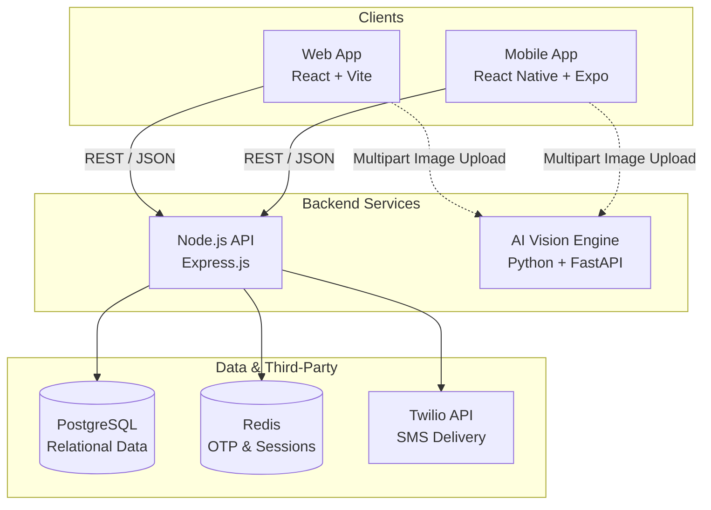
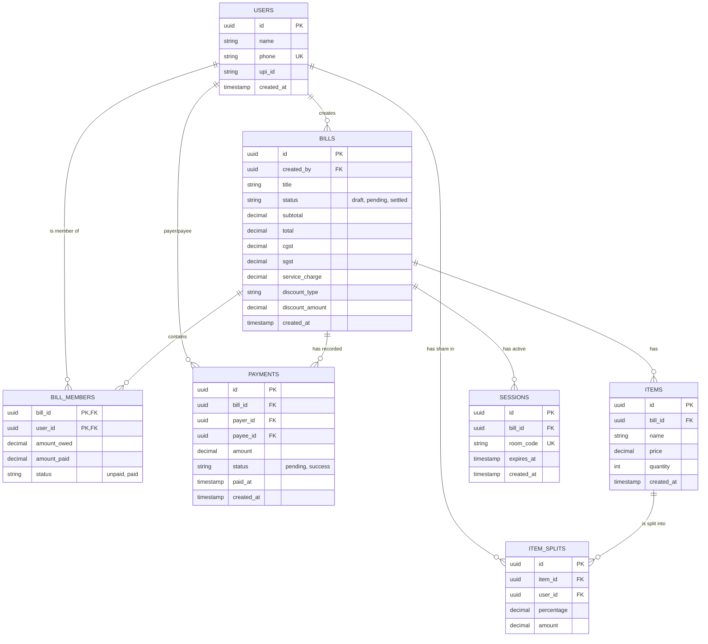

# Split.ai

Split bills.

Split.ai is a modern, AI-powered bill splitting application built for both Web and Mobile. It completely removes the friction from shared expenses—whether it's a dinner, a group trip, or household utilities—by letting you simply take a photo of your receipt. The AI extracts the items, you assign who ate or used what, and the app calculates tax, tip, and everyone's final share down to the exact rupee.

## Why Built This

We've all been there staring at a massive receipt with dozens of items, trying to figure out who owes what while factoring in taxes and service charges. It's a headache. Split.ai solves this by:
- **Using AI Vision** to instantly read any receipt or bill and extract items and prices.
- **Handling Complex Math** like proportional tax and tip splitting automatically.
- **Integrating UPI** so you can instantly send payment requests to your friends without asking for their phone numbers again.

## System Architecture

Split.ai uses a microservices-inspired architecture designed for scalability, real-time interaction, and separation of concerns.



### How the Pieces Fit Together:

1. **The Clients (Web & Mobile)**: Both apps share the exact same design language, UI tokens, and core functionality. I use the Context API for state management and Axios for smooth, authenticated data fetching.
2. **The Core API (Node.js)**: Handles all the heavy lifting—authentication (OTP generation and validation), complex split math, room session management, and database interactions.
3. **The Vision Engine (Python)**: A dedicated Python microservice running locally on port `8000`. It receives raw images directly from the clients, processes them using OCR/AI algorithms, and returns structured JSON arrays of items and prices.
4. **Data Storage**: PostgreSQL holds the persistent relational data (Bills, Items, Users, Payments) while Redis acts as a lightning-fast ephemeral cache for 5-minute OTP authentication tokens.

## Database Schema

Split.ai utilizes a robust relational schema in PostgreSQL to manage users, bills, and complex split calculations.



## Key Features

- **Passwordless Auth**: Quick login using Twilio SMS OTPs (with a smart fallback to local memory if Twilio APIs fail or rate-limit during development).
- **Cross-Platform**: Run it in your desktop browser or install it on your phone natively.
- **AI Receipt Scanner**: Upload a photo of any bill or receipt, and watch the items and prices populate automatically.
- **Granular Splitting**: Assign multiple people to a single item. The app automatically divides the cost equally among selected members.
- **Smart Contact Integration**: Tap into your device's native contact book (via Mobile or Chrome's Contact Picker API) to quickly add friends to a bill without typing numbers.
- **One-Click Settlement**: Generates personalized UPI payment links for each member based on their calculated share.

## Tech Stack

- **Frontend**: React.js (Vite), React Native (Expo), React Router, React Navigation
- **Backend**: Node.js, Express.js, Python, FastAPI
- **Database**: PostgreSQL, Redis
- **Styling**: Vanilla CSS (Web) & StyleSheet (Mobile) utilizing custom Glassmorphism tokens for a premium feel.
- **Auth**: JWT & Twilio

## Getting Started (Local Development)

### 1. Database Setup
- Ensure **PostgreSQL** is running locally with a database named `splitai`.
- Ensure **Redis** is running locally on port `6379`.

### 2. Start the Backend API
```bash
cd services/api
npm install
# Set up your .env file with DB credentials and Twilio keys
npm run dev
```

### 3. Start the AI Vision Service
```bash
cd services/ai
pip install -r requirements.txt
uvicorn main:app --reload --port 8000
```

### 4. Start the Web App
```bash
cd apps/web
npm install
npm run dev
```

### 5. Start the Mobile App
```bash
cd apps/mobile
npm install
npx expo start
```
